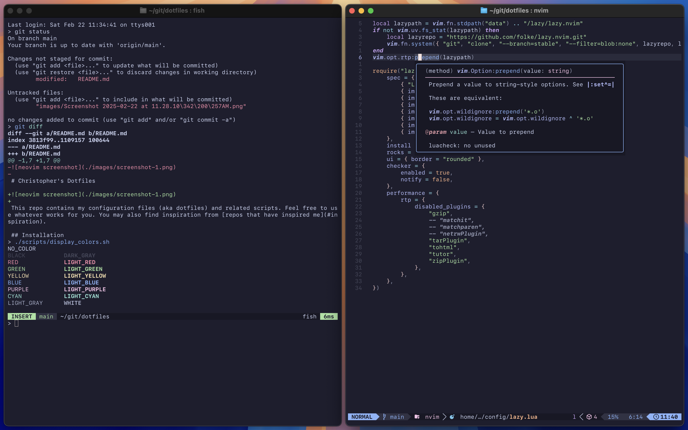

# Christopher's Dotfiles

This repo contains my configuration files (aka dotfiles) and related scripts. Feel free to use whatever works for you. You may also find inspiration from [repos that have inspired me](#inspiration).

## Installation

```bash
bash -c "$(curl -fsSL https://raw.githubusercontent.com/cpplain/dotfiles/main/bin/cfgmanager)"
```

## Basic Setup

- OS: [macOS](https://support.apple.com/macos)
- Package manager: [Homebrew](https://brew.sh)
- Terminal: [Ghostty](https://ghostty.org/)
- Shell: [fish](https://fishshell.com)
- Prompt: [Oh My Posh](https://ohmyposh.dev)
- Editor: [Neovim](https://github.com/neovim/neovim) ([LazyVim](https://www.lazyvim.org/))
- Font: [SF Mono](https://developer.apple.com/fonts/)
- Symbols: [Symbols Nerd Font](https://www.nerdfonts.com)
- Theme: [Catppuccin](https://github.com/wez/wezterm)

## Inspiration

- [branchvincent / dotfiles](https://github.com/branchvincent/dotfiles)
- [cgsdev0 / dotfiles](https://github.com/cgsdev0/dotfiles)
- [craftzdog / dotfiles-public](https://github.com/craftzdog/dotfiles-public)
- [fatih / dotfiles](https://github.com/fatih/dotfiles)
- [GeekMasher / .dotfiles](https://github.com/GeekMasher/.dotfiles)
- [LazyVim / LazyVim](https://github.com/LazyVim/LazyVim)
- [nvim-lua / kickstart.nvim](https://github.com/nvim-lua/kickstart.nvim)
- [stevearc / dotfiles](https://github.com/stevearc/dotfiles)
- [ThePrimeagen / neovimrc](https://github.com/ThePrimeagen/neovimrc)
- [tjdevries / config_manager](https://github.com/tjdevries/config_manager)
