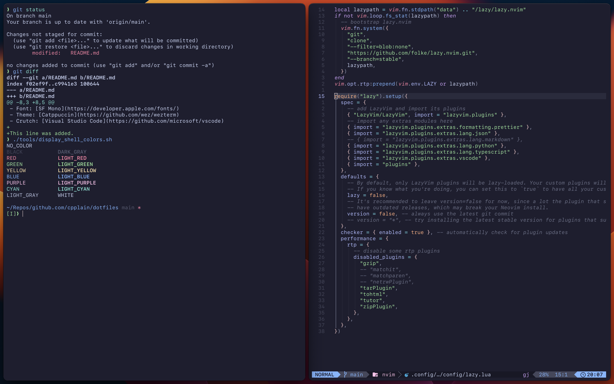

# Christopher's Dotfiles

- OS: [macOS](https://support.apple.com/macos)
- Window Manger: [yabai](https://github.com/koekeishiya/yabai) with [skhd](https://github.com/koekeishiya/skhd) shortcuts
- Terminal: [WezTerm](https://github.com/wez/wezterm)
- Shell: [Fish](https://fishshell.com) and [Zsh](https://www.zsh.org)
- Editor: [Neovim](https://github.com/neovim/neovim) via [LazyVim](https://github.com/LazyVim/LazyVim)
- Font: [SF Mono](https://developer.apple.com/fonts/)
- Theme: [Catppuccin](https://github.com/wez/wezterm)
- Crutch: [Visual Studio Code](https://github.com/microsoft/vscode)
